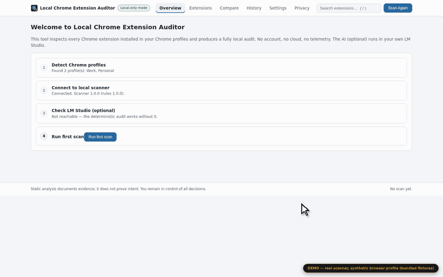
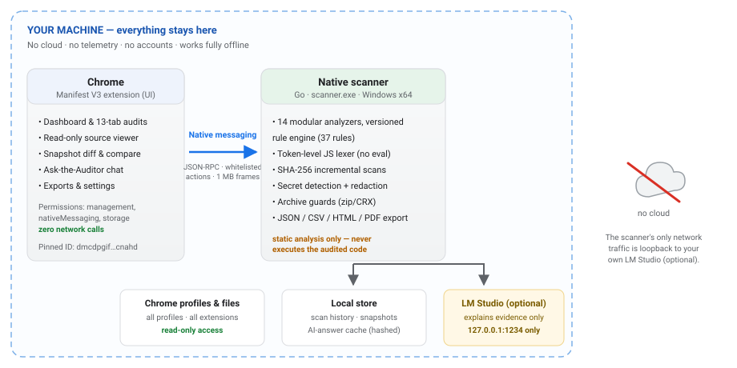
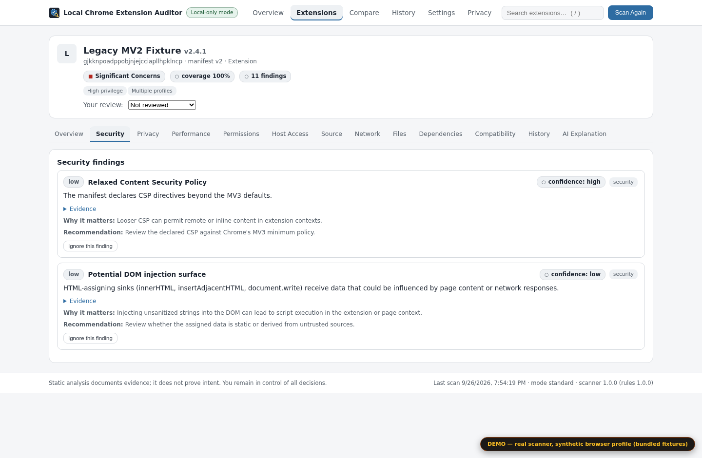
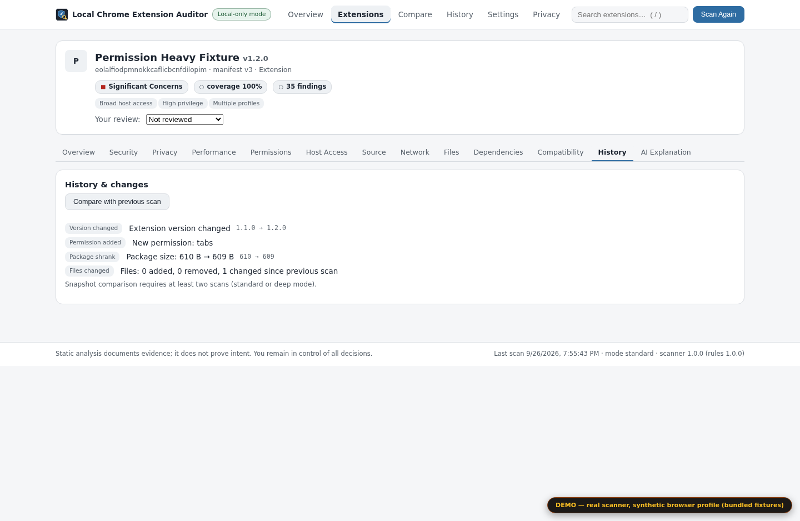
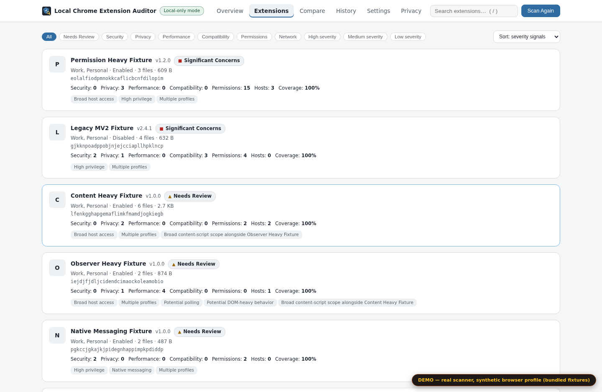
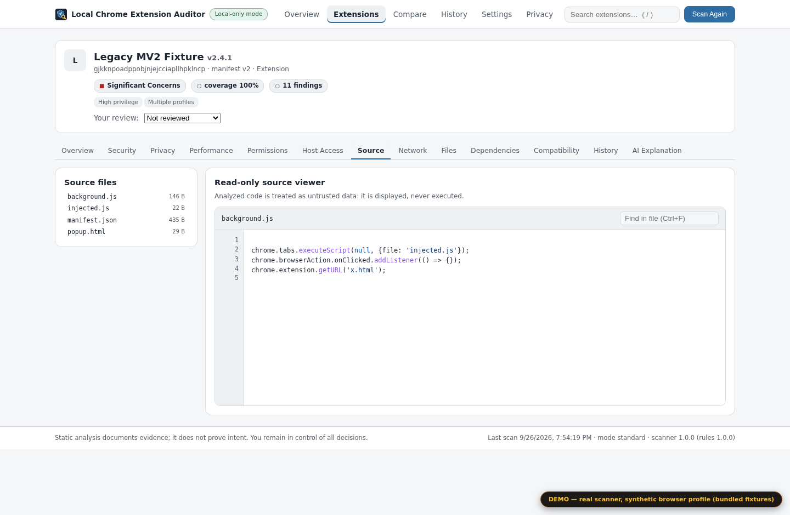
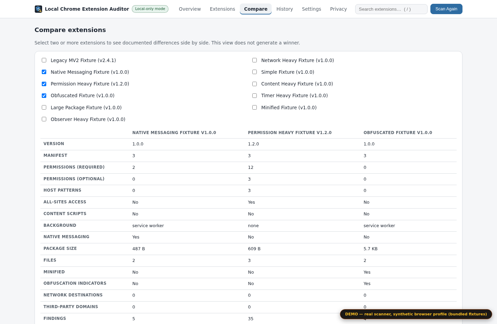
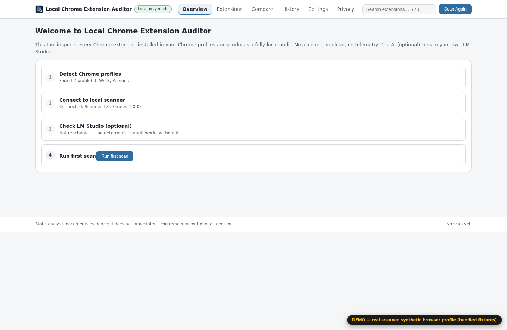

<div align="center">

# Local Chrome Extension Auditor

**A 100% local security, privacy & performance audit of every Chrome extension installed on your computer.**

Evidence, not verdicts. No cloud. No telemetry. No scores.

[](https://github.com/kimpearce888/chrome-extension-auditor/actions/workflows/ci.yml)
[](https://github.com/kimpearce888/chrome-extension-auditor/releases)
[](LICENSE)
[](https://github.com/kimpearce888/chrome-extension-auditor/releases)
[](docs/PRIVACY.md)

[Installation](#installation) · [Try the demo](#try-it-without-installing-anything) · [How it works](#how-it-works) · [Findings philosophy](#what-a-finding-looks-like) · [vs other tools](#how-this-compares-to-other-tools) · [Limitations](docs/LIMITATIONS.md)

</div>

---

Your browser extensions can read and modify almost everything you see online. They hold permissions like *read my cookies*, *run code on every page*, *talk to a native binary on your machine* — and they quietly change with every update. Store review helps, but the only reviewer who can see **your** installed versions, **your** profiles and **your** history of permission changes is you.

This tool gives you that visibility:

- 🔎 **Audits every extension, in every Chrome profile** on the machine — security, privacy, performance, compatibility and code health in one pass.
- 🧾 **Shows evidence, not verdicts.** Every finding carries a file, a line, a manifest field. Severity and confidence are rated separately, and wording is calibrated (`Potential…` ≠ `Detected…`). It never says "this extension is malware" — it shows you what the code actually does and lets you decide.
- 📸 **Snapshot diffs** — the flagship feature: rescan after an update and see exactly what changed: new permissions, new host patterns, new network destinations, new findings, package growth.
- 🌐 **Fully local.** The scanner is a standalone Go binary; the extension has zero network permissions; the only optional network call anywhere is loopback to *your own* [LM Studio](https://lmstudio.ai) for AI explanations. Unplug the internet — everything still works.
- 🔒 **Read-only.** It never disables, modifies, or uninstalls anything. It never executes the code it audits.
- 🧯 **Audits itself.** `npm run scan:self` points the scanner at its own extension package — the README you are reading was shipped by a tool that ran on itself.



*Everything in this tour is genuine analyzer output on the [bundled test fixtures](fixtures/) via the [demo harness](#try-it-without-installing-anything) — no mock data, no staged screenshots. Full-resolution still: [dashboard overview](docs/screenshots/overview.png).*

## What it checks

| Area | Examples of documented evidence |
|---|---|
| **Permissions** | what each permission actually grants, declared-but-unused permissions, optional permission escalation paths |
| **Host access** | `<all_urls>`, wildcard subdomains, non-HTTPS schemes, breadth of match patterns |
| **Security** | `eval` / `new Function` call sites, DOM injection surfaces, remote code loading, native messaging exposure, relaxed CSP, embedded secrets (redacted) |
| **Privacy** | browsing-history inference (tabs/webRequest), cookie access, analytics & tracking endpoints, fingerprinting indicators |
| **Performance** | aggressive timers, unbounded observers, heavy content scripts injected into every page, bundle sizes |
| **Compatibility** | Manifest V2 deprecation, removed MV3 APIs (`chrome.tabs.executeScript`, `browser_action`…), obsolete fields |
| **Code health** | minification vs obfuscation (different things!), readability scoring, duplicate/outdated bundled libraries |
| **Network** | every destination referenced in code, classified (CDN, analytics, unknown), third-party domains |
| **Package** | size, file inventory, source maps, stray private keys, build junk |
| **Changes** | scan-to-scan diffs: version, permissions, hosts, files, findings |

Three scan depths: **Quick** (manifest + permissions), **Standard** (+ full source, network, performance, dependencies), **Deep** (+ AI interpretation and snapshot comparison).

## How it works



A Chrome MV3 extension (TypeScript + Vite) provides the UI and enumerates extensions via `chrome.management`. All filesystem analysis happens in a **Go native scanner** (`scanner.exe`) reached through native messaging — a strict, whitelisted JSON-RPC protocol over stdio. The scanner never executes audited code; it lexes JavaScript at token level, hashes every file (SHA-256, incremental rescans), and writes scan history + snapshots to a local store. AI explanations, when enabled, are generated by your own LM Studio instance on `127.0.0.1:1234` — prompted with redacted evidence wrapped in explicit `BEGIN/END SCANNED EVIDENCE` delimiters, with schema validation, one retry, and a deterministic offline fallback.

The full contract between extension and scanner — every action, parameter and error code — is documented in [docs/PROTOCOL.md](docs/PROTOCOL.md). The threat model, path-validation rules and archive hardening live in [docs/SECURITY.md](docs/SECURITY.md).

## Installation

Requirements: Windows 10/11 x64 and Google Chrome.

1. Download `Local-Chrome-Extension-Auditor-Windows.zip` from the [latest release](https://github.com/kimpearce888/chrome-extension-auditor/releases) and extract it to a folder you control (e.g. `C:\Tools\Local-Extension-Auditor`).
2. Run **`Install.bat`**. It registers the native messaging host per-user (HKCU registry only — no elevation, no admin, no services).
3. Chrome will not silently install self-hosted extensions, and this project will not pretend otherwise: open `chrome://extensions`, enable **Developer mode**, click **Load unpacked**, and select the `extension` folder from the extracted package.
4. Click the auditor's toolbar icon (or press <kbd>Alt</kbd>+<kbd>Shift</kbd>+<kbd>A</kbd>) and run your first scan.

**Optional AI:** install [LM Studio](https://lmstudio.ai), start its local server, download any chat model, then in the auditor: *Settings → LM Studio → Test Connection*. Without it you still get the complete technical audit — the AI layer only adds plain-language explanations and the Ask-the-Auditor chat.

Anything behaving oddly? **`Diagnose.bat`** runs a full PASS/FAIL checklist (host registration, protocol loopback, permissions, data directory). Uninstalling is equally boring: **`Uninstall.bat`** removes only this tool's own artifacts.

## Try it without installing anything

The repo includes a demo harness that serves the real dashboard against the real scanner with a synthetic browser profile built from the bundled fixtures — perfect for UI development, screenshots, or a risk-free look around:

```bash
git clone https://github.com/kimpearce888/chrome-extension-auditor.git
cd chrome-extension-auditor
npm install
npm run build
npm run demo        # → http://127.0.0.1:4318/
```

The page is clearly labelled as a demo; every finding you see is genuine analyzer output.

## What a finding looks like

No "trust score 87/100". A finding is structured evidence you can check yourself:

```json
{
  "id": "PERM-001",
  "category": "permissions",
  "severity": "high",
  "confidence": "high",
  "title": "Requests the cookies permission",
  "summary": "The manifest requests 'cookies'…",
  "evidence": [{ "file": "manifest.json", "note": "permissions: [\"cookies\"]" }],
  "whyItMatters": "…can read cookies for every site the extension has host access to…",
  "recommendation": "Check whether cookie access is core to the feature…"
}
```

Severity (**critical / high / medium / low / informational**) and confidence (**high / medium / low**) are always separate — a low-confidence signal is presented as exactly that. You can mark findings reviewed, ignore them locally (evidence is kept), and annotate extensions with your own notes. Sorting and filtering are presentation tools, never rankings: **the tool does not decide which extension is "bad" — you do.**



### Snapshot diffs: see what changed since last scan

Extensions update silently. Rescan and the auditor diffs the snapshot against the previous one:



New permissions, new domains and new findings after an update are the classic "this got creepier while I wasn't looking" signal — now you see it the moment it happens.

### And the rest of the UI

| | |
|---|---|
|  |  |
| *Inventory with filters and search* | *Read-only source viewer with finding markers* |
|  |  |
| *Side-by-side compare — differences, no winners* | *First-run connectivity checks* |

## Security & trust model

- **Read-only audit.** The scanner opens extension packages read-only; it cannot and does not disable, patch, or uninstall anything.
- **Whitelisted protocol.** Sixteen actions, nothing else — every unknown action is refused. UI-supplied paths are validated against traversal, symlink escape, UNC and non-root targets; scanner-discovered paths get a separate, deliberately restricted validation tier.
- **Static analysis only.** Audited code is lexed, never executed. The source viewer renders text; it is not a runtime.
- **Secrets are redacted at the source.** Detected patterns (API keys, tokens, private keys) are shown truncated and hashed — in the UI, in exports, and in anything sent to LM Studio.
- **Archive hardening.** Scanning `.zip`/`.crx` archives enforces entry-count, ratio and nesting limits (zip bombs), and rejects path traversal and symlink entries.
- **The extension has zero network permissions.** A CI lint fails the build if any non-local URL appears in the source or the built output.
- **The scanner's only network traffic** is loopback to your own LM Studio, which is optional.

Full details: [docs/SECURITY.md](docs/SECURITY.md) · [docs/PRIVACY.md](docs/PRIVACY.md)

## What this tool is *not*

Honesty is a feature. This is **not** an antivirus, not a malware verdict engine, and not proof of safety. Static analysis cannot see server-side behavior, runtime-generated code, or intent; heuristics are labeled as heuristics. It documents evidence so *you* can make an informed decision. The complete list of known blind spots is maintained in [docs/LIMITATIONS.md](docs/LIMITATIONS.md) — reading it is the best way to understand what the tool can and cannot tell you.

## How this compares to other tools

There is real browser-extension security tooling out there — it just lives at different points on the *who-analyzes-what-and-where* spectrum. An honest map (checked September 2026; services change — correction PRs welcome):

| Tool | Model | What it's genuinely good at | What it doesn't do |
|---|---|---|---|
| **CRXcavator** (Duo Labs) | Cloud database | Pioneered mass risk-scoring of the entire Web Store; powered years of extension-security research | **Gone.** The service shut down and its domain no longer resolves — after which “audit what's installed on my machine” went back to being a manual chore |
| **CRXplorer**, **ExtensionShield** and similar web scanners | Cloud | Paste a Web Store URL *before* installing and get a risk score, permission severity breakdown and source viewer; enterprise bulk scans | They analyze the current *store listing* — not necessarily the version installed on your machine (the two can differ); every lookup tells a server which extensions you're curious about; a single score hides the evidence behind it |
| **ExtAnalysis** | Local, open source | The forensics community's workhorse for deep manual analysis of CRX/XPI files — URL retrohunts, domain intel, VirusTotal lookups | Built for analysts feeding it packages one at a time: no installed inventory, no multi-profile view, no scan history, no “what changed since the update” |
| **CRX Source Viewer** | Browser extension | Instantly read the source of any store-listed extension — great for spot checks | It's a viewer: no analysis, no findings, no diffs, nothing about what's installed |
| `chrome://extensions` + Safety Check | Built into Chrome | Always available; per-extension permission lists; store-status verdicts | Verdicts without visible evidence; no cross-time comparison; no multi-profile roll-up |
| Antivirus browser companions | Commercial blockers | Real-time blocking of known-bad pages and downloads | They block, they don't explain — and they themselves request broad permissions |

These are complements, not competitors. A sensible workflow: a paste-a-URL scanner *before* you install something new, this auditor *after* — and regularly, because extensions change under you — and a forensics framework when a single package deserves the full treatment.

The combination this project exists for:

- **Your installed state** — every Chrome profile, the version actually on disk, not the store listing
- **100% local** — no query about your extension set ever leaves the machine
- **Evidence instead of scores** — severity and confidence rated separately, file/line references, calibrated wording
- **Change tracking over time** — snapshot diffs that catch the classic “it was fine when I installed it” problem
- **Read-only by design** — an audit tool that can modify your browser is itself a risk

If you know of another tool that already covers this exact combination, open an issue — linking it here beats duplicating it.

## Development

```bash
npm install          # dependencies (extension toolchain only — scanner is stdlib Go)
npm run dev          # vite dev server for the dashboard UI
npm run build        # build extension + verify output integrity
npm test             # go vet + full Go test suite (52 tests)
npm run lint         # local-only lint: no remote resources in src or dist
npm run scan:self    # the auditor audits its own extension package
npm run demo         # demo harness (real scanner + synthetic profile)
npm run package      # build + cross-compile scanner.exe + assemble release ZIP
```

The animated README tour is reproducible, not staged: with the demo server running, `node scripts/demo-gif.mjs` drives the real dashboard through a scripted first-run story (Playwright), and `python3 scripts/make-gif.py` assembles the frames into `docs/screenshots/demo.gif` (Pillow).

The Go scanner deliberately uses **zero third-party modules**, so the Windows cross-compile (`GOOS=windows GOARCH=amd64 go build .`) is hermetic and reproducible. The repository carries 14 fixture extensions — deliberately misbehaving ones (broad hosts, embedded secrets, obfuscation, MV2 legacy, malformed manifests…) — that the test matrix scans for expected findings. No test ever asserts a hardcoded "expected result" without scanning real fixture input.

<details>
<summary><strong>Repository layout</strong></summary>

```
├── extension/        # Chrome MV3 extension (TypeScript, Vite)
│   ├── src/core/     #   native messaging client, shared types
│   ├── src/dashboard/#   SPA: overview, list, detail (13 tabs), compare, …
│   └── src/popup/    #   toolbar popup
├── native/           # Go scanner (stdlib only, cross-compiles to Windows x64)
│   └── rules/        #   embedded, versioned rule sets (permissions, APIs, deps)
├── installer/        # Install.bat / Uninstall.bat / Diagnose.bat + PowerShell
├── fixtures/         # 14 synthetic test extensions for the scanner test matrix
├── scripts/          # build / test / lint / self-audit / package / demo
├── docs/             # README (package), PROTOCOL, SECURITY, PRIVACY, LIMITATIONS
└── .github/          # CI (test + lint + self-audit + package) and release workflows
```
</details>

<details>
<summary><strong>FAQ</strong></summary>

**Does it send anything anywhere?** No. No cloud, no telemetry, no accounts, no crash reporting. The only optional network connection is to your own LM Studio on loopback. You can verify this in the source — or just unplug the network and use it.

**Why Windows only?** The native host registration, path validation and installer target Windows first (that's where the biggest audience is). The scanner itself is portable Go; macOS/Linux support is a matter of installer + profile-path work — contributions welcome.

**Why is there no risk score?** Because a single number hides the evidence and manufactures false authority. Two findings rated "high severity, low confidence" and "high severity, high confidence" are very different situations; collapsing them into "72/100" would be dishonest either way.

**Can it remove a suspicious extension?** No — deliberately. Read-only is a security property: an audit tool that can modify your browser is itself a risk. Uninstalling stays a manual, deliberate act by you.

**Is the AI required?** No. LM Studio integration is optional and additive; the deterministic audit is complete without it. When LM Studio is unreachable, AI features fall back to static, locally generated explanations.

**How do I verify the extension is really local-only?** Run `npm run lint` (it fails on any non-local URL in source or build output), read [docs/PROTOCOL.md](docs/PROTOCOL.md) for the complete action whitelist, or watch the scanner with a network monitor — you'll see loopback at most.
</details>

## License

[MIT](LICENSE) — use it, fork it, learn from it.

Built evidence-first on purpose: the tool's job is to show you what is there, not to make you feel something about it.
